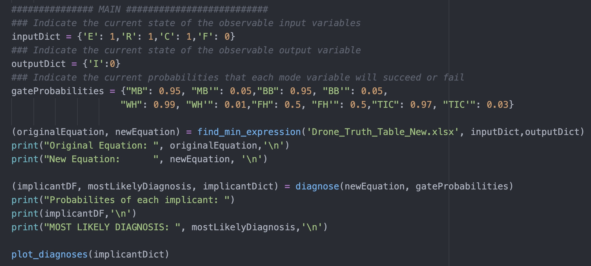

# Cognitive-Robotics-Diagnosis
Generating implicates and essential prime implicants. Using essential prime implicants to diagnose. 

## Project Description
This project demonstrates how essential prime implicants can be generated using Quine-McCluskey and used to diagnose a system. We also explored how to modify Quine-McCluskey to produce the implicates of a system (which can be converted and used to enable diagnosis). Our motivation is centered around the diagnosis of faults in search-and-rescue (SAR) drones. A schematic of the search and rescue drone is shown below:


## Prerequisties
Make sure you have Python installed on your system. You can download Python [here](https://www.python.org/downloads/).

The project also requires the following Python packages:

* pandas
* itertools
* ttg

You can install these packages using pip:
```bash
pip install pandas
pip install itertools
pip install truth-table-generator
```
## Built With
* Python - The programming language used 
* pandas - Data manipulation and analysis library
* itertools - Functions creating iterators for efficient looping
* ttg - Simplifies the process of creating truth tables by providing a convenient interface to define logical expressions and automatically generate corresponding truth tables. With ttg, you can quickly evaluate logical expressions, validate Boolean functions, and analyze logical relationships.

## Usage
### Diagnosis using implicants:
#### drone-truth-table-generator.py:
* this file converts the system theory of the search-and-rescue drone into a form readable by the ttg python package. It outputs the Excel file "Drone_Truth_Table.xlsx" that contains a truth table that describes the system.
#### drone-QM-implementation.py:
* This file outputs the most likely diagnosis given our drone truth table ("Drone_Truth_Table.xlsx") as an input. This algorithm simplifies the drone theory into prime implicants. Users may also adjust the gate probabilities to see how the algorithm outputs a different most likely diagnosis.
### Generating implicates:
#### truth-table-generator.py:
* This file outputs a truth table in excel format. Users can define the logic of the sysetm (how the observable varialbes and mode varirables work together). The script generates a full truth table. The truth tables for all Python scripts have already been included in the repository, not requiring users to run this file.
#### quine_mccluskey.py:
* This file outputs the prime implicants of the truth table generated by "Polycell_Truth_Table.xlsx" The purpose of this file was to create an initial proof of concept to create the prime implicants given a truth table.
#### quine_mccluskey_cnf.py:
* This file outputs the conjunctive normal form (prime implicates as a product of sums) of the truth table generated by "Polycell_Truth_Table.xlsx" The purpose of this file was to create an initial proof of concept to create the conjunctive normal form given a truth table.
#### drone-QM-implementation_cnf.py:
* This file outputs the conjunctive normal form (implicates as a product of sums) of the truth table generated by "Drone_Truth_Table.xlsx". The output of 240 clauses are the implicates for the drone function, but are not simplified to prime implicates. Further research would simplify the output to reduce the number of conflicts to be checked.

## Walkthrough for diagnosis using implicants
#### Generate a truth table
1) Input information about the system's logic into truth-table-generator.py and run the script. The script will generate an Excel file containing the truth table

2) Manually edit the resulting Excel file containing the truth table by adding the word "Term" to cell A1

3) Update drone-QM-implementation.py with the current values of the observable input variables, observable output variables, and probabilities that each mode variable will break or be good

4) Run the script to produce a most likely diagnosis that will look like the graph below. In the case below, the most likely diagnosis is that the thermal imaging camera is broken (TIC')


## Authors
* Caeley Harihara - charihara
* Steven Hubbard - shubbardjr
